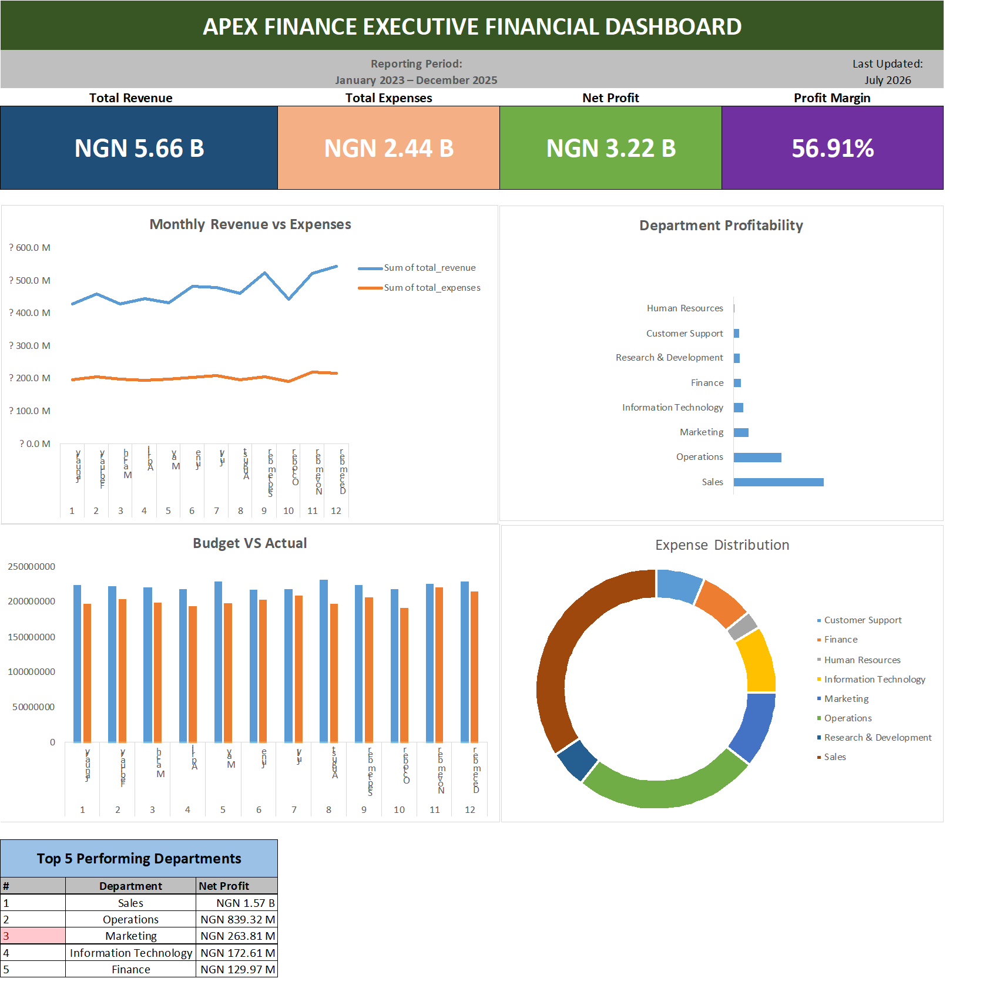
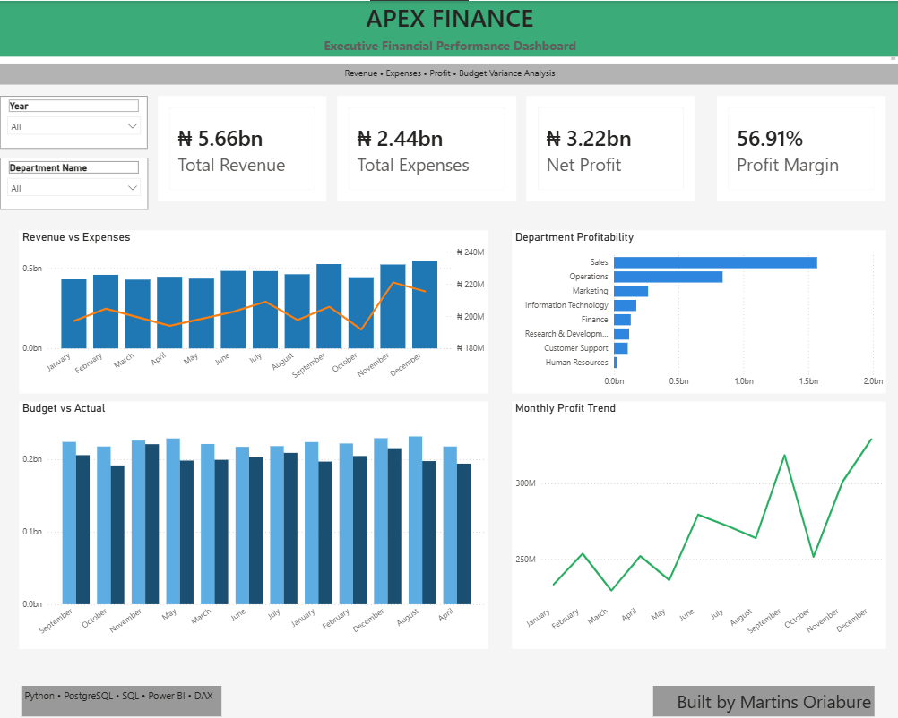

# Apex Finance Ltd. – Executive Financial Performance Dashboard

## Project Overview

This project showcases an end-to-end Business Intelligence solution developed for **Apex Finance Ltd.** The objective was to transform raw financial data into an interactive executive dashboard that enables stakeholders to monitor revenue, expenses, profitability, and budget performance across departments and reporting periods.

The solution demonstrates a complete BI workflow using **Python, PostgreSQL, SQL, Microsoft Excel, Power BI, and DAX**.

---

# Business Problem

Financial executives require accurate and timely insights to answer critical business questions such as:

- How much revenue is the business generating?
- Which departments are the most profitable?
- Are expenses increasing faster than revenue?
- How does actual spending compare with the approved budget?
- How is profitability changing over time?

This dashboard provides a single source of truth for executive decision-making.

---

# Project Workflow

```
Python
        ↓
Synthetic Enterprise Dataset
        ↓
PostgreSQL Database
        ↓
SQL Views & Business Logic
        ↓
Advanced Excel Analysis
        ↓
Power BI Executive Dashboard
```

---

# Tools & Technologies

- Python
- PostgreSQL
- SQL
- Microsoft Excel
- Power BI
- DAX

---

# Dataset

The project uses a simulated enterprise financial dataset representing the operations of Apex Finance Ltd.

The dataset includes:

- Revenue Transactions
- Expense Transactions
- Department Information
- Budget Data
- Calendar Table

Python was used to generate realistic financial data across multiple departments and reporting periods.

---

# SQL Development

SQL was used to:

- Design the relational database
- Create reporting views
- Aggregate financial metrics
- Calculate:
  - Total Revenue
  - Total Expenses
  - Net Profit
  - Profit Margin
  - Budget Variance

Views created:

- vw_kpi_summary
- vw_department_performance
- vw_monthly_financials
- vw_budget_variance

---

# Advanced Excel Analysis

Microsoft Excel was used to develop an executive financial reporting workbook.

Techniques demonstrated include:

- XLOOKUP
- IFERROR
- Data Validation
- Dynamic Drop-down Lists
- Custom Number Formatting
- Executive Financial Reporting

Deliverables:

- Interactive Executive Dashboard
- Executive PDF Report

---

# Power BI Dashboard

The Power BI dashboard provides interactive executive reporting through:

### KPI Cards

- Total Revenue
- Total Expenses
- Net Profit
- Profit Margin

### Interactive Visualizations

- Revenue vs Expenses Trend
- Department Profitability
- Budget vs Actual Analysis
- Monthly Profit Trend

### Interactive Filters

- Year
- Department

---

# Business Insights

The dashboard enables management to:

- Monitor financial performance over time
- Identify high-performing departments
- Compare actual spending against planned budgets
- Track profitability trends
- Support strategic financial decision-making

---

# Skills Demonstrated

### Business Intelligence

- Executive Dashboard Design
- KPI Reporting
- Financial Reporting
- Data Storytelling

### SQL

- Database Design
- Views
- Aggregations
- Joins
- Business Logic

### Excel

- XLOOKUP
- IFERROR
- Data Validation
- Financial Reporting
- Custom Formatting

### Power BI

- Data Modeling
- Relationships
- DAX Measures
- Interactive Dashboards
- Slicers
- Executive Reporting

### Python

- Synthetic Data Generation
- Automated Dataset Creation

---

# Repository Structure

```
Apex Finance Ltd. - Executive Financial Performance Dashboard
│
├── Data
│
├── SQL
│   ├── tables.sql
│   ├── views.sql
│   └── queries.sql
│
├── Excel
│   └── ApexFinance_Executive_Dashboard.xlsx
│
├── Power BI
│   └── ApexFinance_Executive_Dashboard.pbix
│
├── Images
│   ├── excel_dashboard.png
│   └── powerbi_dashboard.png
│
├── PDF
│   ├── excel_dashboard.pdf
│   └── powerbi_dashboard.pdf
│
├── Documentation
│   └── Project Journal.pdf
│
└── README.md
```

---

# Dashboard Preview

## Excel Executive Dashboard



---

## Power BI Executive Dashboard



---

# Author

**Martins Oriabure**

Business Intelligence Analyst | Data Analyst

### Core Technologies

Python • PostgreSQL • SQL • Microsoft Excel • Power BI • DAX