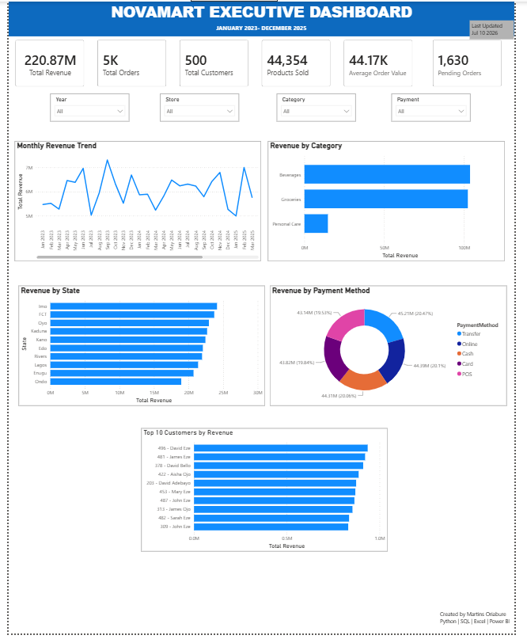
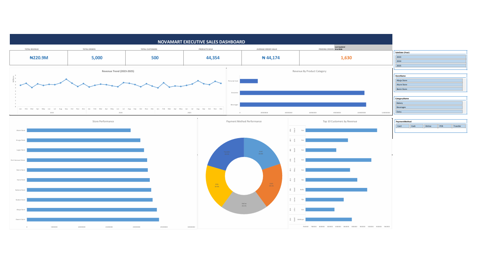

# 🛒 Novamart Executive Sales Dashboard

An end-to-end Business Intelligence project that demonstrates the complete analytics workflow—from generating a realistic retail dataset with Python, to performing business analysis with SQL, validating insights in Excel, and building an interactive executive dashboard in Power BI.

---

## 📌 Project Overview

This project simulates a retail company's sales reporting system by transforming raw transactional data into meaningful business insights. The dashboard enables executives and business stakeholders to monitor key performance indicators (KPIs), analyze sales trends, evaluate customer purchasing behaviour, and support data-driven decision-making.

---

## 🎯 Business Objectives

The dashboard was designed to answer key business questions, including:

- What is the total revenue generated?
- How many orders were completed?
- Which product categories generate the highest revenue?
- Which states contribute the most sales?
- Which payment methods are most frequently used?
- Who are the top 10 customers by revenue?
- How does revenue trend over time?
- How many orders are currently pending?

---
## 🛠️ Technology Stack

| Tool | Purpose |
|------|---------|
| **Python** | Generated a realistic retail sales dataset with multiple related tables. |
| **Microsoft Excel** | Validated the generated data, created Pivot Tables, and designed the initial dashboard prototype. |
| **SQL** | Answered business questions, calculated KPIs, and verified analytical results. |
| **Power BI** | Built the interactive executive dashboard using data modeling, DAX measures, relationships, and slicers. |

---

## 🔄 Project Workflow

The project followed a complete Business Intelligence workflow:

### 1. Dataset Generation (Python)
A realistic retail dataset was generated using Python to simulate business operations across customers, products, categories, stores, employees, orders, and sales transactions.

### 2. Data Validation & Dashboard Prototype (Excel)
The generated dataset was validated in Microsoft Excel. Pivot Tables and Pivot Charts were used to verify calculations and create the first version of the executive dashboard.

### 3. Business Analysis (SQL)
SQL queries were written to answer important business questions, validate KPIs, and analyze sales performance across different dimensions.

### 4. Interactive Dashboard Development (Power BI)
The cleaned data was imported into Power BI, where relationships were created, a Date table was built, DAX measures were developed, and an interactive executive dashboard was designed for business users.

---
## 📂 Dataset

The dataset represents a fictional retail company, **Novamart**, and was generated using Python to simulate real-world business transactions.

### Tables Included

- Customers
- Products
- Categories
- Stores
- Employees
- Orders
- Sales

The dataset contains approximately **5,000 retail sales transactions** across a three-year period from **January 2023 to December 2025**, providing sufficient historical data for trend analysis, customer behaviour analysis, and executive reporting.

---

## 📈 Dashboard Features

The Power BI dashboard includes:

### Executive KPIs

- Total Revenue
- Total Orders
- Total Customers
- Products Sold
- Average Order Value
- Pending Orders

### Interactive Visualizations

- Monthly Revenue Trend
- Revenue by Category
- Revenue by State
- Revenue by Payment Method
- Top 10 Customers by Revenue

### Interactive Filters

- Year
- Store
- Category
- Payment Method

These slicers allow users to dynamically filter the dashboard and explore sales performance across different business dimensions.

---
## 💡 Key Business Insights

The dashboard revealed several important business insights:

- Revenue trends vary across different months, highlighting periods of stronger and weaker sales performance.
- A small group of customers contributes a significant portion of total revenue, demonstrating the importance of customer retention.
- Sales performance differs by state, allowing management to identify high-performing and underperforming locations.
- Certain product categories consistently outperform others, providing opportunities to optimize inventory and marketing strategies.
- Payment method analysis reveals customer purchasing preferences, helping improve payment experience and operational planning.
- Monitoring pending orders enables management to identify operational bottlenecks and improve order fulfillment efficiency.

---

## 📋 Business Recommendations

Based on the analysis, the following recommendations can improve business performance:

- Increase marketing efforts during lower-performing sales periods.
- Develop loyalty programs targeting the highest-value customers.
- Investigate underperforming stores and implement targeted improvement strategies.
- Allocate more inventory and promotional resources to high-performing product categories.
- Optimize staffing and logistics to reduce pending orders and improve customer satisfaction.
- Continue monitoring payment preferences to support customer convenience and operational efficiency.


---
## 📸 Dashboard Preview

### Power BI Executive Dashboard

Interactive executive dashboard built in Power BI featuring KPI cards, dynamic slicers, and visual analysis of revenue, customer performance, product categories, payment methods, and sales trends.



---

### Microsoft Excel Dashboard Prototype

Initial dashboard prototype developed in Microsoft Excel using Pivot Tables, Pivot Charts, and GETPIVOTDATA formulas before recreating the final interactive version in Power BI.



---

## 📂 Repository Structure

```
Novamart-Sales-Executive-Dashboard
│
├── Dashboard
│   ├── Novamart_Sales_Executive_Dashboard.pbix
│   └── Dashboard.pdf
│
├── Dataset
│   └── Novamart_Dataset.xlsx
│
├── SQL
│   └── SQL_Queries.sql
│
├── Images
│   ├── Excel_Dashboard.png
│   └── PowerBI_Dashboard.png
│
└── README.md
```

---

## 🚀 Skills Demonstrated

- Business Intelligence
- Data Cleaning
- Data Validation
- Data Modeling
- SQL Analysis
- DAX Measures
- KPI Development
- Dashboard Design
- Executive Reporting
- Data Visualization
- Power Query
- Star Schema Modeling
- Interactive Reporting
- Business Storytelling

---

## 👨‍💻 Author

**Martins Oriabure**

**Tools Used**

- Python
- SQL
- Microsoft Excel
- Power BI

---

⭐ If you found this project interesting, feel free to star the repository.
